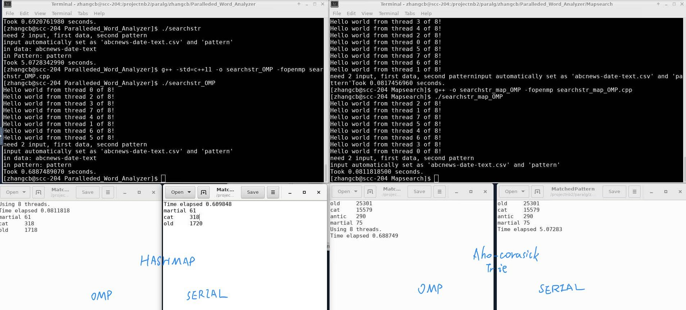

# Paralleded_Word_Analyzer
A Paralleded word matching and ranking algorithm

------

## Content

----
- [Paralleded_Word_Analyzer](#paralleded_word_analyzer)
  - [Content](#content)
  - [Set up](#set-up)
    - [Compile](#compile)
  - [Algorithm Part:](#algorithm-part)
    - [**Hashmap Word Search**](#hashmap-word-search)
    - [**Aho Corasick Algorithm:**](#aho-corasick-algorithm)
  - [Result](#result)
  - [**Files**](#files)

----

## Set up

----
The OMP version files is tested running on Boston University SCC server.

Use:
``` shell
qrsh -l h_rt=1:00:00 -P paralg
```
to rent a server on scc server.

### Compile
The OMP version cpp file can be compiled using following script:
``` shell
$ module load gcc
$ g++ -o searchstr_map_OMP -fopenmp searchstr_map_OMP.cpp
$ export OMP_NUM_THREADS = 8
$ ./searchstr_map_OMP
```

----

## Algorithm Part:

----

### **Hashmap Word Search**


The Algorithm then read in pattern line by line using `ifstream` and store them in a `unordered_map<string,int>` where `int` is the word count set initial to zero.

Then it read the file to be search and use a `vector<string>` to store it.

Then it use `#pragma omp parallel for` to loop the vector and add to `map[string]->second` to count numbers.

-----

### **Aho Corasick Algorithm:** 


**Intro**:

For practical situation, people seldom search only one keyword, most search algorithms are fast but can not deal with multiple pattern. So they need to go over the data multiple times for multiple patterns. 

Suppose there are **M** patterns of lengths **L1**, **L2**, …, **Lm**. We need to find all matches of patterns from a dictionary in a text of length **N**.

A trivial solution would be taking any algorithm from the first part and running it **M** times. We have complexity of **O(N + L1 + N + L2 + … + N + Lm)**, i.e. **O(M \* N + L)**.

We find Aho Corasick Algorithm can handle this situation with complexity **O(N + L + Z)**, where **Z** is the count of matches.

------

**How it works:**

Aho Corasick algorithm basically build a tree, where every node has a link to parent, a map to multiple children, a single character value, and a "redirect link", we will explain it later.

The core Idea is that, when matching failed at some character, instead of going over, it use "redirect link" to get to the longest possible substring (count from the last character of the pattern) , go that substring branch and continue.

For example, suppose we have pattern ATG, TGC, and GCA, we can construct a tree like this:

====R====

A===T===G

T===G===C

G===C===A

That R stand for Root. If we failed at ATX,  that is, T(3,1)  has no child X, we will follow its redirect link, which in this situation, will link to T(2,2). Also, if we fail at TGX, we go to G(1,3).

If any attempt gets to the bottom node of the tree then a pattern is matched.

So, by going over this tree, we can find matched pattern by only scanning the data for one time.

-----

**Data structure:**

The class CAhoTree in is defined in AhoCorasickAlg.hpp, with properties and functions below:

Private:

1. Structure SNode:
   1. nId int, the id of the node;
   2. nValue char, the value for matching;
   3. nHeight int, the height of node on the tree;
   4. pParent pointer, point to parent node;
   5. pRedirect pointer, point to the redirect node,
                       if the matching fails, go this way for next match;
   6. mapChild map<char, SNode*> link parent to their children;
   7. bEndNode decide if the node is a end of a matching pattern;

Public:

1. Construct method CAhoTree and destroy method ~CAhoTree;
2. AddPattern
   1. from root, walk the tree by the character of the pattern, if walk into a dead end, build a  branch using what is left in input string, the last character of the string is matched as bEndNode;
3. Redirecting
   1. go through every exist node with same key  (every new node will be pushed into a local map, key is char nValue , value is the set of nodes with char nValue);
   2.  Try connect them, Call function ConnectRedirectNode;
4. MatchPattern
   1. Return if there exist any match, stops at first match, faster than searching method;
5. SearchPattern
   1. search all matches, find matched patterns, call GenerateOutput to return a output string, insert it in a map, return this map, key is matched pattern, value is this pattern's matched count;
6. SearchCount 
   1. return the sum of  matched times of all pattern;

Private:

1.  NewNode
   1. Called by function AddPattern;
   2. create a new node pointer with initial value and push it into node map and node vector;
2.  ConnectRedirectNode
   1. Called by function Redirecting;
   2. evaluate this 2 nodes and connect them if passed evaluation;
3. CaseConvert
   1. in case-not-sensitive situation, transfer upper case to lower case
4. GenerateOutput
   1. send a endnode in, go from it to the root and get the whole matched word, return it as a string.

Much detailed version can be viewed from the code comment.

------

## Result

----



----

## **Files**

----

- Mapsearch
  - searchstr_map.cpp
  - searchstr_map_OMP.cpp
- AhoCorasick
  - AhoCorasickAlg.hpp: The algorithm, class CAhoTree.
  - searchstr.cpp: main function, read input files, call Aho-Corasick Tree and generate output file.
  - AhoCorasickAlg_OMP.hpp: the omp version of the hpp file
  - searchstr_OMP.cpp: the omp version of the main file
- Datas
  - abcnews-date-text: a huge dataset of tweets.
  - data: a wikipedia page of cat.
  - pattern: the patterns you want to search.


